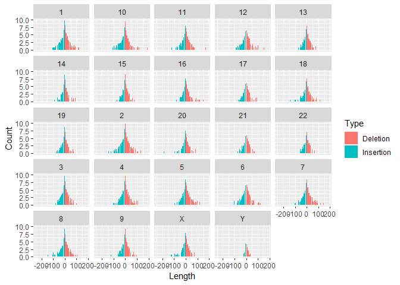
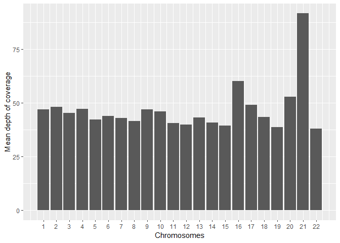

# Rozwiązania zadań

### plik `rozwiazania_zadan.R` zawiera skrypt

### Zad1

    library(stringr)

    upperlower <- function (x) {
      x_split <- unlist(strsplit(x, ''))
      even_list <- list()
      odd_list <- list()
      for (i in 1:length(x_split)) {
        if (i %% 2 == 0) {
          even_list <- append(even_list, toupper(x_split[i]))
        } else {
          even_list <- append(even_list, x_split[i])
        } 
      }
      for (i in 1:length(x_split)) {
        if (i %% 2 != 0) {
          odd_list <- append(odd_list, toupper(x_split[i]))
        } else {
          odd_list <- append(odd_list, x_split[i])
        } 
      }
    return(list(
      paste(even_list, collapse = ''),
      paste(odd_list,collapse = '')
    ))
    }

    test <- upperlower(letters[5:20])
    test

    ## [[1]]
    ## [1] "eFgHiJkLmNoPqRsT"
    ## 
    ## [[2]]
    ## [1] "EfGhIjKlMnOpQrSt"

### Zad2

    test1 <- 'ABBA'
    test2 <- 'aBcbA'
    test3 <- 'RabarbArka'

    letter_count <- function (x) {
      x_split <- unlist(strsplit(x, ''))
      low <- tolower(x_split)
      t <- table(low)
      for (i in 1:dim(t)) {
        if (t[[i]] > 1) {
          print(
            t[i]
            )
          }
      }
    }

    letter_count(test1)

    ## a 
    ## 2 
    ## b 
    ## 2

    letter_count(test2)

    ## a 
    ## 2 
    ## b 
    ## 2

    letter_count(test3)

    ## a 
    ## 4 
    ## b 
    ## 2 
    ## r 
    ## 3

### Zad 3 (można to szybciej zrobić tabixem ale rozumiem że sprawdzian zakłada korzystanie z R)

    library(data.table)
    vcf <- fread('../CPCT02220079.annotated.processed.vcf.gz',skip=402,sep='\t')

    colnames(vcf)[1] <- 'Chromosome'

    library(tidyverse)

    ## Warning: package 'tidyverse' was built under R version 4.0.3

    ## -- Attaching packages -------------------------------------------------------------------------------------------- tidyverse 1.3.0 --

    ## <U+221A> ggplot2 3.3.2     <U+221A> purrr   0.3.4
    ## <U+221A> tibble  3.0.3     <U+221A> dplyr   1.0.2
    ## <U+221A> tidyr   1.1.2     <U+221A> forcats 0.5.0
    ## <U+221A> readr   1.3.1

    ## -- Conflicts ----------------------------------------------------------------------------------------------- tidyverse_conflicts() --
    ## x dplyr::between()   masks data.table::between()
    ## x dplyr::filter()    masks stats::filter()
    ## x dplyr::first()     masks data.table::first()
    ## x dplyr::lag()       masks stats::lag()
    ## x dplyr::last()      masks data.table::last()
    ## x purrr::transpose() masks data.table::transpose()

    chr12 <-  vcf %>% filter(Chromosome == '12' & POS >= 112204691 & POS <= 112247789)
    write.table(chr12,'chr12_010421.csv',quote = F,row.names = F,sep='\t')

### Zad 4

    ### Length > 0 = insercje
    ### Length < 0 = delecje
    vcf$Length <- nchar(vcf$REF) - nchar(vcf$ALT)

    plot_vcf <- vcf %>% group_by(Chromosome,Length) %>% summarise(Count = log(n())) %>% filter(Length != 0 & Count > 0) %>% 
      mutate(Type = ifelse(Length < 0,'Insertion','Deletion'))

    ## `summarise()` regrouping output by 'Chromosome' (override with `.groups` argument)

    plot_vcf  %>% ggplot() + geom_col(aes(x=Length, y= Count, fill=Type)) + 
      facet_wrap(~Chromosome) + ggsave('indels.png',height = 15, width=15)

    write.table(plot_vcf,'indels_010421.csv',quote = F,row.names = F,sep='\t')

## Zad5 (pracuje nad tym)

    vcf_het <- vcf %>% filter(FILTER == 'PASS')
    vcf_het$GoNLv5 <- str_extract(vcf_het$INFO, ';GoNLv5_AF=.*;')
    vcf_het$GoNLv5 <- gsub('GoNLv5_AF=','',vcf_het$GoNLv5)
    vcf_het$GoNLv5 <- as.numeric(gsub(';','',vcf_het$GoNLv5))

    vcf_het$af.05 <- str_extract(vcf_het$INFO, ';AF=0.5;')
    vcf_het$af.05 <- gsub(';AF=','',vcf_het$af.05)
    vcf_het$af.05 <- as.numeric(gsub(';','',vcf_het$af.05))

    vcf_het_filtered <- vcf_het %>% filter(is.na(af.05) == F) %>% filter(GoNLv5 < 0.01 & is.na(GoNLv5) == F)

    ### Liczba wariantów z AF < 0.01
    vcf_het_filtered %>% summarise('AF < 0.01'=n())

    ##   AF < 0.01
    ## 1     38873

## Zad6

    noauto <- c('X','Y','MT')

    avg_cov <- vcf %>% filter(!(Chromosome %in% noauto)) %>% 
      separate(CPCT02220079R, c('GT', 'AD', 'DP'), sep=':',extra='drop') %>% select(Chromosome, DP)

    avg_cov$DP <- as.numeric(avg_cov$DP)

    avg_cov[is.na(avg_cov$DP)] <- 0
    mean(avg_cov$DP)

    ## [1] 45.98891

    chr_plot <- avg_cov %>% group_by(Chromosome) %>% summarise(avg_cov = mean(DP))

    ## `summarise()` ungrouping output (override with `.groups` argument)

    chr_plot$Chromosome <- as.numeric(chr_plot$Chromosome)

    chr_plot %>% ggplot(aes(Chromosome,avg_cov)) + geom_bar(stat = 'identity') + ylab('Mean depth of coverage') + 
      xlab('Chromosomes') + scale_x_continuous(breaks=seq(1,22,1)) + ggsave('cov_per_chr.png',height = 15, width=15)  

    write.table(chr_plot, 'cov_per_chr.csv',sep='\t',quote = F,row.names = F)

## Zad 8

### Funkcja do obliczania VAF dla indeli

    library(vcfR)

    ## Warning: package 'vcfR' was built under R version 4.0.4

    ## 
    ##    *****       ***   vcfR   ***       *****
    ##    This is vcfR 1.12.0 
    ##      browseVignettes('vcfR') # Documentation
    ##      citation('vcfR') # Citation
    ##    *****       *****      *****       *****

    strelka_vaf <- function(x) {
      streika_vcf <- read.vcfR(x)
      streika_tidy <- vcfR2tidy(streika_vcf)
      streika_indel <- streika_tidy$gt
      
      streika_vaf <- streika_indel %>% select(Indiv, gt_TAR,gt_TIR)
      streika_vaf <- streika_vaf %>% separate(gt_TAR, into = c('tier1RefCounts','tar'),remove = T,convert = T) %>% select(-tar)
      streika_vaf <-  streika_vaf %>% separate(gt_TIR, into = c('tier1AltCounts','tir'),remove = T,convert = T) %>% select(-tir)
      
      streika_vaf$VAF <- streika_vaf$tier1AltCounts/(streika_vaf$tier1RefCounts+streika_vaf$tier1AltCounts)
      streika_vaf$VAF <- ifelse(is.nan(streika_vaf$VAF),0,streika_vaf$VAF)
      return(streika_vaf)
    }

    ### VAF dla indeli
    indel <- strelka_vaf('../T1_vs_N1_head.strelka.somatic.indels.norm.vcf.gz')

    ## Scanning file to determine attributes.
    ## File attributes:
    ##   meta lines: 211
    ##   header_line: 212
    ##   variant count: 49788
    ##   column count: 11
    ## Meta line 211 read in.
    ## All meta lines processed.
    ## gt matrix initialized.
    ## Character matrix gt created.
    ##   Character matrix gt rows: 49788
    ##   Character matrix gt cols: 11
    ##   skip: 0
    ##   nrows: 49788
    ##   row_num: 0
    ## Processed variant 1000Processed variant 2000Processed variant 3000Processed variant 4000Processed variant 5000Processed variant 6000Processed variant 7000Processed variant 8000Processed variant 9000Processed variant 10000Processed variant 11000Processed variant 12000Processed variant 13000Processed variant 14000Processed variant 15000Processed variant 16000Processed variant 17000Processed variant 18000Processed variant 19000Processed variant 20000Processed variant 21000Processed variant 22000Processed variant 23000Processed variant 24000Processed variant 25000Processed variant 26000Processed variant 27000Processed variant 28000Processed variant 29000Processed variant 30000Processed variant 31000Processed variant 32000Processed variant 33000Processed variant 34000Processed variant 35000Processed variant 36000Processed variant 37000Processed variant 38000Processed variant 39000Processed variant 40000Processed variant 41000Processed variant 42000Processed variant 43000Processed variant 44000Processed variant 45000Processed variant 46000Processed variant 47000Processed variant 48000Processed variant 49000Processed variant: 49788
    ## All variants processed

    ## Extracting gt element DP

    ## Extracting gt element DP2

    ## Extracting gt element TAR

    ## Extracting gt element TIR

    ## Extracting gt element TOR

    ## Extracting gt element DP50

    ## Extracting gt element FDP50

    ## Extracting gt element SUBDP50

    ## Extracting gt element BCN50

    write.table(indel,'streika_indel.csv',sep='\t',quote=F,row.names = F)

### VAF dla snv

#### Nie wiedziałem jak to zrobić (znaczy wiedziaĹ‚em ale był‚o to zbyt toporne by udostsępniać to publicznie)

#### więc postanowiłem wykorzystać gotowe rozwiązanie <https://github.com/biobenkj/StrelkaParser>

    parse_vcf_alt1 <- function(x) {
      vcf <- readr::read_tsv(x, comment = "##")
      vcf <- dplyr::rename(vcf, CHROM = `#CHROM`)
      vcf <- dplyr::mutate(vcf, ALT = strsplit(ALT, ",") %>% purrr::map_chr(1),
                           info = parse_info(INFO),
                           normal = parse_format(FORMAT, NORMAL),
                           tumour = parse_format(FORMAT, TUMOR))
      vcf <- tidyr::unnest(vcf, info)
      vcf <- tidyr::unnest(vcf, N = normal, T = tumour, .sep = "_")
      vcf <- purrr::lmap_at(vcf, dplyr::matches("[TN]_[ACTG]U", vars = names(vcf)), split_tiers)
      vcf <- readr::type_convert(vcf)
      vcf <- tidyr::gather(vcf, allele, count, dplyr::matches("[TN]_[ACTG]U_[12]"))
      vcf <- tidyr::separate(vcf, allele, c("sample", "base", "tier"), sep = "[_U]+", remove = FALSE)
      vcf <- dplyr::group_by(vcf, CHROM, POS, REF, ALT)
      vcf <- dplyr::mutate(vcf, T_REF_COUNT = count[REF == base & sample == "T" & tier == TQSS_NT],
                           T_ALT_COUNT = count[ALT == base & sample == "T" & tier == TQSS_NT],
                           N_REF_COUNT = count[REF == base & sample == "N" & tier == TQSS_NT],
                           N_ALT_COUNT = count[ALT == base & sample == "N" & tier == TQSS_NT],
                           T_VAF = T_ALT_COUNT / (T_ALT_COUNT + T_REF_COUNT),
                           N_VAF = N_ALT_COUNT / (N_ALT_COUNT + N_REF_COUNT))
      vcf <- dplyr::select(vcf, -sample, -base, -tier)
      vcf <- tidyr::spread(vcf, allele, count)  # Takes up most of the time
      vcf
    }
    row_tibble <- function(x, col_names) {
      tibble::as_tibble(rbind(setNames(x, col_names)))
    }

    parse_format <- function(format, sample) {
      purrr::map2(
        strsplit(sample, ":", fixed = TRUE),
        strsplit(format, ":", fixed = TRUE),
        row_tibble)
    }

    parse_info <- function(info) {
      strsplit(info, ";", fixed = TRUE) %>%
        purrr::map(~row_tibble(sub("^.*=(.*)", "\\1", .x), sub("^(.*)=.*", "\\1", .x)))
    }

    split_tiers <- function(x) {
      name <- names(x)
      x$`1` <- x[[1]] %>%
        strsplit(",", fixed = TRUE) %>%
        purrr::map(~as.integer(.x[1])) %>%
        purrr::flatten_int()
      x$`2` <- x[[1]] %>%
        strsplit(",", fixed = TRUE) %>%
        purrr::map(~as.integer(.x[2])) %>%
        purrr::flatten_int()
      names(x)[2:3] <- paste0(name, "_", names(x)[2:3])
      x[2:3]
    }

    calc_counts <- function(x) {
      T_REF_COUNT_KEY <- paste0("T_", x$REF, "U_", x$TQSS_NT)
      T_ALT_COUNT_KEY <- paste0("T_", x$ALT, "U_", x$TQSS_NT)
      N_REF_COUNT_KEY <- paste0("N_", x$REF, "U_", x$TQSS_NT)
      N_ALT_COUNT_KEY <- paste0("N_", x$ALT, "U_", x$TQSS_NT)
      T_REF_COUNT <- x[[T_REF_COUNT_KEY]]
      T_ALT_COUNT <- x[[T_ALT_COUNT_KEY]]
      N_REF_COUNT <- x[[N_REF_COUNT_KEY]]
      N_ALT_COUNT <- x[[N_ALT_COUNT_KEY]]
      T_VAF <- T_ALT_COUNT / (T_ALT_COUNT + T_REF_COUNT)
      N_VAF <- N_ALT_COUNT / (N_ALT_COUNT + N_REF_COUNT)
      data.frame(T_VAF = T_VAF, N_VAF = N_VAF)
    }

    snv <- parse_vcf_alt1('../T1_vs_N1_head.strelka.somatic.snvs.norm.vcf.gz')

    ## Parsed with column specification:
    ## cols(
    ##   `#CHROM` = col_double(),
    ##   POS = col_double(),
    ##   ID = col_character(),
    ##   REF = col_character(),
    ##   ALT = col_character(),
    ##   QUAL = col_character(),
    ##   FILTER = col_character(),
    ##   INFO = col_character(),
    ##   FORMAT = col_character(),
    ##   NORMAL = col_character(),
    ##   TUMOR = col_character()
    ## )

    ## Warning: unnest() has a new interface. See ?unnest for details.
    ## Try `df %>% unnest(c(N, T))`, with `mutate()` if needed

    ## Warning: The `.sep` argument of `unnest()` is deprecated as of tidyr 1.0.0.
    ## Use `names_sep = '_'` instead.
    ## This warning is displayed once every 8 hours.
    ## Call `lifecycle::last_warnings()` to see where this warning was generated.

    ## Parsed with column specification:
    ## cols(
    ##   .default = col_double(),
    ##   ID = col_character(),
    ##   REF = col_character(),
    ##   ALT = col_character(),
    ##   QUAL = col_character(),
    ##   FILTER = col_character(),
    ##   INFO = col_character(),
    ##   FORMAT = col_character(),
    ##   NORMAL = col_character(),
    ##   TUMOR = col_character(),
    ##   SOMATIC = col_character(),
    ##   NT = col_character(),
    ##   SGT = col_character()
    ## )

    ## See spec(...) for full column specifications.

    snv_save <- snv %>% select(CHROM,POS,ID,REF,ALT,T_VAF,N_VAF)
    write.table(snv_save,'streika_snv.csv',sep='\t',quote = F,row.names = F)
