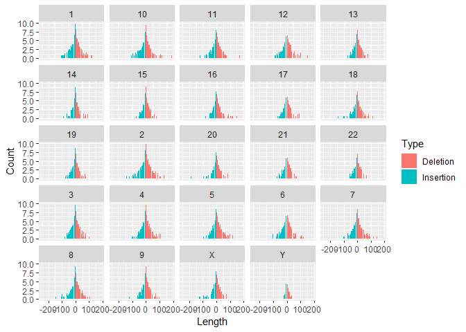
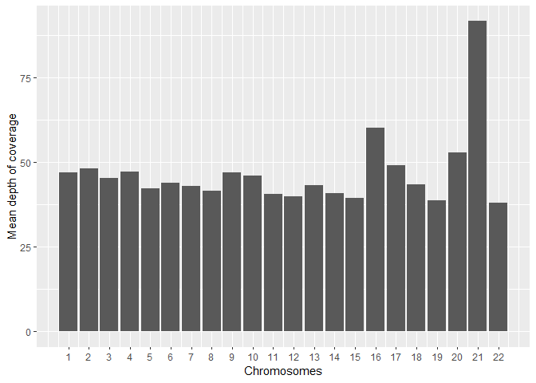

### Zad1

    library(stringr)

    upperlower <- function (x) {
      x_split <- unlist(strsplit(x, ''))
      even_list <- list()
      odd_list <- list()
      for (i in 1:length(x_split)) {
        if (i %% 2 == 0) {
          even_list <- append(even_list, toupper(x_split[i]))
        } else {
          even_list <- append(even_list, x_split[i])
        } 
      }
      for (i in 1:length(x_split)) {
        if (i %% 2 != 0) {
          odd_list <- append(odd_list, toupper(x_split[i]))
        } else {
          odd_list <- append(odd_list, x_split[i])
        } 
      }
    return(list(
      paste(even_list, collapse = ''),
      paste(odd_list,collapse = '')
    ))
    }
    test <- upperlower(letters[5:20])
    test

    ## [[1]]
    ## [1] "eFgHiJkLmNoPqRsT"
    ## 
    ## [[2]]
    ## [1] "EfGhIjKlMnOpQrSt"

### Zad2

    test1 <- 'ABBA'
    test2 <- 'aBcbA'
    test3 <- 'RabarbArka'

    letter_count <- function (x) {
      x_split <- unlist(strsplit(x, ''))
      low <- tolower(x_split)
      t <- table(low)
      for (i in 1:dim(t)) {
        if (t[[i]] > 1) {
          print(
            t[i]
            )
          }
      }
    }

    letter_count(test1)

    ## a 
    ## 2 
    ## b 
    ## 2

    letter_count(test2)

    ## a 
    ## 2 
    ## b 
    ## 2

    letter_count(test3)

    ## a 
    ## 4 
    ## b 
    ## 2 
    ## r 
    ## 3

### Zad 3 (można to szybciej zrobić tabixem ale rozumiem że sprawdzian zakłada korzystanie z R)

    library(data.table)
    vcf <- fread('../CPCT02220079.annotated.processed.vcf.gz',skip=402,sep='\t')

    colnames(vcf)[1] <- 'Chromosome'

    library(tidyverse)

    ## Warning: package 'tidyverse' was built under R version 4.0.3

    ## -- Attaching packages -------------------------------------------------------------------------------------------- tidyverse 1.3.0 --

    ## <U+221A> ggplot2 3.3.2     <U+221A> purrr   0.3.4
    ## <U+221A> tibble  3.0.3     <U+221A> dplyr   1.0.2
    ## <U+221A> tidyr   1.1.2     <U+221A> forcats 0.5.0
    ## <U+221A> readr   1.3.1

    ## -- Conflicts ----------------------------------------------------------------------------------------------- tidyverse_conflicts() --
    ## x dplyr::between()   masks data.table::between()
    ## x dplyr::filter()    masks stats::filter()
    ## x dplyr::first()     masks data.table::first()
    ## x dplyr::lag()       masks stats::lag()
    ## x dplyr::last()      masks data.table::last()
    ## x purrr::transpose() masks data.table::transpose()

    chr12 <-  vcf %>% filter(Chromosome == '12' & POS >= 112204691 & POS <= 112247789)
    write.table(chr12,'chr12_010421.csv',quote = F,row.names = F,sep='\t')

### Zad 4

    ### Length > 0 = insercje
    ### Length < 0 = delecje
    vcf$Length <- nchar(vcf$REF) - nchar(vcf$ALT)

    plot_vcf <- vcf %>% group_by(Chromosome,Length) %>% summarise(Count = log(n())) %>% filter(Length != 0 & Count > 0) %>% 
      mutate(Type = ifelse(Length < 0,'Insertion','Deletion'))

    ## `summarise()` regrouping output by 'Chromosome' (override with `.groups` argument)

    plot_vcf  %>% ggplot() + geom_col(aes(x=Length, y= Count, fill=Type)) + 
      facet_wrap(~Chromosome) + ggsave('indels.png',height = 15, width=15)

    write.table(plot_vcf,'indels_010421.csv',quote = F,row.names = F,sep='\t')

## Zad5 (pracuje nad tym)

## Zad6

    noauto <- c('X','Y','MT')

    avg_cov <- vcf %>% filter(!(Chromosome %in% noauto)) %>% 
      separate(CPCT02220079R, c('GT', 'AD', 'DP'), sep=':',extra='drop') %>% select(Chromosome, DP)

    avg_cov$DP <- as.numeric(avg_cov$DP)

    avg_cov[is.na(avg_cov$DP)] <- 0
    mean(avg_cov$DP)

    ## [1] 45.98891

    chr_plot <- avg_cov %>% group_by(Chromosome) %>% summarise(avg_cov = mean(DP))

    ## `summarise()` ungrouping output (override with `.groups` argument)

    chr_plot$Chromosome <- as.numeric(chr_plot$Chromosome)

    chr_plot %>% ggplot(aes(Chromosome,avg_cov)) + geom_bar(stat = 'identity') + ylab('Mean depth of coverage') + 
      xlab('Chromosomes') + scale_x_continuous(breaks=seq(1,22,1)) + ggsave('cov_per_chr.png',height = 15, width=15)  

    write.table(chr_plot, 'cov_per_chr.csv',sep='\t',quote = F,row.names = F)

## Zad 8

### VAF dla snv

#### Nie wiedziałem jak to zrobić więc postanowiłem wykorzystać gotowe rozwiązanie <https://github.com/biobenkj/StrelkaParser>

    snv <- parse_vcf_alt1('../T1_vs_N1_head.strelka.somatic.snvs.norm.vcf.gz')

    ## Parsed with column specification:
    ## cols(
    ##   `#CHROM` = col_double(),
    ##   POS = col_double(),
    ##   ID = col_character(),
    ##   REF = col_character(),
    ##   ALT = col_character(),
    ##   QUAL = col_character(),
    ##   FILTER = col_character(),
    ##   INFO = col_character(),
    ##   FORMAT = col_character(),
    ##   NORMAL = col_character(),
    ##   TUMOR = col_character()
    ## )

    ## Warning: unnest() has a new interface. See ?unnest for details.
    ## Try `df %>% unnest(c(N, T))`, with `mutate()` if needed

    ## Warning: The `.sep` argument of `unnest()` is deprecated as of tidyr 1.0.0.
    ## Use `names_sep = '_'` instead.
    ## This warning is displayed once every 8 hours.
    ## Call `lifecycle::last_warnings()` to see where this warning was generated.

    ## Parsed with column specification:
    ## cols(
    ##   .default = col_double(),
    ##   ID = col_character(),
    ##   REF = col_character(),
    ##   ALT = col_character(),
    ##   QUAL = col_character(),
    ##   FILTER = col_character(),
    ##   INFO = col_character(),
    ##   FORMAT = col_character(),
    ##   NORMAL = col_character(),
    ##   TUMOR = col_character(),
    ##   SOMATIC = col_character(),
    ##   NT = col_character(),
    ##   SGT = col_character()
    ## )

    ## See spec(...) for full column specifications.

    head(snv$T_VAF)

    ## [1] 0.04375000 0.04347826 0.05263158 0.13750000 0.08974359 0.03424658

    head(snv$N_VAF)

    ## [1] 0.00990099 0.00000000 0.00000000 0.07236842 0.06875000 0.04316547

### VAF dla indeli
